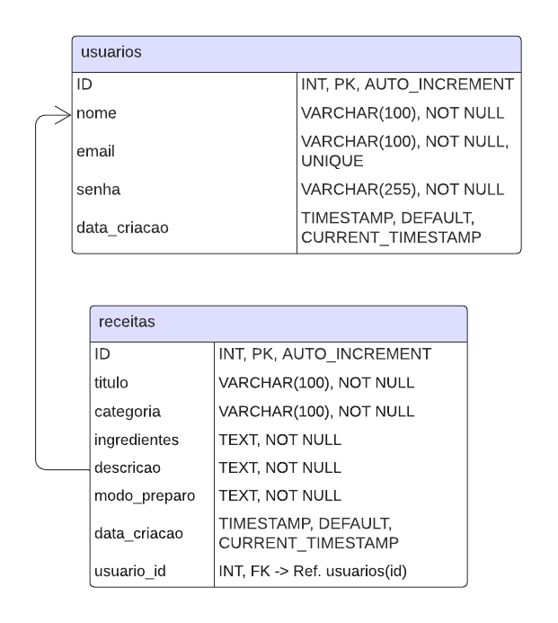

# 🍳 Aplicativo de Receitas

## 📜 Descrição da Ideia
O Aplicativo de Receitas é uma plataforma interativa que permite aos usuários compartilhar, buscar e descobrir novas receitas. O objetivo é criar uma comunidade de amantes da culinária, onde todos possam contribuir com suas criações e encontrar inspiração para suas refeições. 🍽️

## ⚙️ Recursos Principais
- **Cadastro de usuário**: Realizar login para publicar receitas. 📝
- **Cadastro de Receitas**: Usuários podem criar e publicar suas receitas com ingredientes, instruções e fotos. 🍲📸

## 🎯 Público-Alvo
O público-alvo inclui amantes da culinária, cozinheiros iniciantes e experientes, e qualquer pessoa que busca novas ideias para suas refeições. 👩‍🍳👨‍🍳

## 📊 ER - Diagrama


## 🛠️ Tecnologias Utilizadas
- **Backend**: PHP (puro) 🖥️
- **Frontend**: 
  - CSS, JS, HTML 🎨

## 🔌 Dependências
- PHP 8.0 ou superior 🔢
- Servidor web: Laragon 🌐
- Banco de dados: MySQL 💾

## 📥 Instruções de Instalação
1. Clone este repositório:  
   ```bash
   git clone https://github.com/seuusuario/aplicativo-receitas.git
